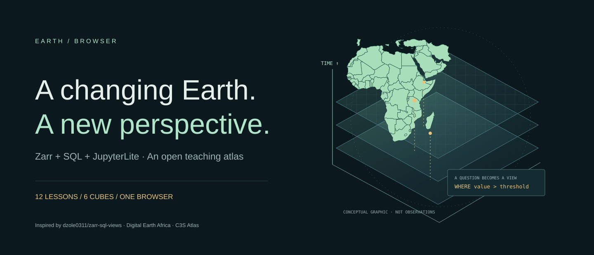
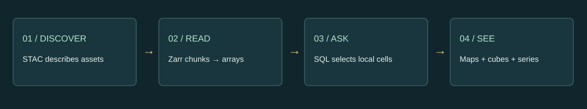

# Earth in the Browser



**A JupyterLite + Jupyter Book teaching atlas for Zarr, SQL, and Earth observation in the browser.** Twelve executable Python lessons connect small data cubes to 2D maps, 3D extruded maps, orbitable space–time cubes, coastal scenes, and linked time series.

Inspired by and adapted from **[dzole0311/zarr-sql-views](https://github.com/dzole0311/zarr-sql-views)**. This independent teaching adaptation preserves upstream attribution and its ISC license.

[](https://github.com/jltobias/JupyterLite-zarr-sql-views/actions/workflows/pages.yml)

## Open the teaching site

- **[Splash page and course home](https://jltobias.github.io/JupyterLite-zarr-sql-views/)**
- **[Interactive Earth lab](https://jltobias.github.io/JupyterLite-zarr-sql-views/lab/)**
- **[JupyterLite notebooks](https://jltobias.github.io/JupyterLite-zarr-sql-views/lite/lab/index.html)**
- **[Jupyter Book](https://jltobias.github.io/JupyterLite-zarr-sql-views/book/intro.html)**
- [Instructor guide](https://jltobias.github.io/JupyterLite-zarr-sql-views/book/teaching.html) · [Data provenance](https://jltobias.github.io/JupyterLite-zarr-sql-views/book/data.html) · [Credits](https://jltobias.github.io/JupyterLite-zarr-sql-views/book/credits.html) · [Troubleshooting](https://jltobias.github.io/JupyterLite-zarr-sql-views/book/accessibility.html)

These URLs are served by the repository’s GitHub Pages deployment. The Actions badge above reports the build/deployment state. No data-service account or notebook server is required for the bundled lessons. Initial runtime downloads require internet access; some optional external services have separate accounts and terms.

## Explore the lab demos

| Experiment | Open a view | Data origin |
|---|---|---|
| Lake Ngami surface water, Botswana | [2D map](https://jltobias.github.io/JupyterLite-zarr-sql-views/lab/?dataset=ngami&mode=map) · [3D map](https://jltobias.github.io/JupyterLite-zarr-sql-views/lab/?dataset=ngami&mode=columns) · [time cube](https://jltobias.github.io/JupyterLite-zarr-sql-views/lab/?dataset=ngami&mode=cube) | **Observed** DE Africa WOfS extract, 2018/2020/2022 |
| African heat seasonality | [Space–time cube](https://jltobias.github.io/JupyterLite-zarr-sql-views/lab/?dataset=heat&mode=cube) | **Synthetic**, not ERA5 or thermal-stress observations |
| Coastal height and sea-level reasoning | [3D scene](https://jltobias.github.io/JupyterLite-zarr-sql-views/lab/?dataset=coast&mode=scene) | **Synthetic** terrain; not an inundation forecast |
| Air quality and exposure reasoning | [3D extruded map](https://jltobias.github.io/JupyterLite-zarr-sql-views/lab/?dataset=air&mode=columns) | **Synthetic**, not CAMS or station data |
| Water-quality optical proxies | [Animated map](https://jltobias.github.io/JupyterLite-zarr-sql-views/lab/?dataset=water&mode=map) | **Synthetic** reflectance; not drinking-water safety |
| Rainfall, food and water insecurity | [Time cube](https://jltobias.github.io/JupyterLite-zarr-sql-views/lab/?dataset=rain&mode=cube) | **Synthetic**, not crop yield or food-security estimates |

Try `value > 0.5 AND t = 0` in the Lake Ngami lab. Switch perspective, move through time, click a cell for its history, and export your selection to GeoJSON. Export includes selected cells across **all** times; the map’s slider chooses one displayed slice. Open the result in [GeoLibre Web](https://web.geolibre.app/).



## Run the lessons

Each notebook includes learning objectives, short Python cells, explanatory Markdown, an infographic, generated visualizations, a linked interactive lab where relevant, exercises, interpretation guidance, and source credits. The C3S lesson includes an official creator-hosted tutorial video and a text alternative. The rendered book includes executed outputs for reading without a running kernel.

| Lesson | JupyterLite | Jupyter Book |
|---|---|---|
| 01 · A browser is a scientific workspace | [Run](https://jltobias.github.io/JupyterLite-zarr-sql-views/lite/lab/index.html?path=01_start_here.ipynb) | [Read](https://jltobias.github.io/JupyterLite-zarr-sql-views/book/notebooks/01_start_here.html) |
| 02 · From Zarr chunks to SQL rows | [Run](https://jltobias.github.io/JupyterLite-zarr-sql-views/lite/lab/index.html?path=02_zarr_sql.ipynb) | [Read](https://jltobias.github.io/JupyterLite-zarr-sql-views/book/notebooks/02_zarr_sql.html) |
| 03 · Lake Ngami: water observations and missing evidence | [Run](https://jltobias.github.io/JupyterLite-zarr-sql-views/lite/lab/index.html?path=03_deafrica_water.ipynb) | [Read](https://jltobias.github.io/JupyterLite-zarr-sql-views/book/notebooks/03_deafrica_water.html) |
| 04 · 2D maps, 3D maps, and a space–time cube | [Run](https://jltobias.github.io/JupyterLite-zarr-sql-views/lite/lab/index.html?path=04_maps_and_cubes.ipynb) | [Read](https://jltobias.github.io/JupyterLite-zarr-sql-views/book/notebooks/04_maps_and_cubes.html) |
| 05 · C3S Atlas: scenarios, warming levels, and model spread | [Run](https://jltobias.github.io/JupyterLite-zarr-sql-views/lite/lab/index.html?path=05_c3s_atlas.ipynb) | [Read](https://jltobias.github.io/JupyterLite-zarr-sql-views/book/notebooks/05_c3s_atlas.html) |
| 06 · Global heat questions, African heat laboratory | [Run](https://jltobias.github.io/JupyterLite-zarr-sql-views/lite/lab/index.html?path=06_heat_stress.ipynb) | [Read](https://jltobias.github.io/JupyterLite-zarr-sql-views/book/notebooks/06_heat_stress.html) |
| 07 · Sea-level rise and the meaning of a 3D scene | [Run](https://jltobias.github.io/JupyterLite-zarr-sql-views/lite/lab/index.html?path=07_coastal_scenes.ipynb) | [Read](https://jltobias.github.io/JupyterLite-zarr-sql-views/book/notebooks/07_coastal_scenes.html) |
| 08 · Air quality: a map is not an exposure estimate | [Run](https://jltobias.github.io/JupyterLite-zarr-sql-views/lite/lab/index.html?path=08_air_quality.ipynb) | [Read](https://jltobias.github.io/JupyterLite-zarr-sql-views/book/notebooks/08_air_quality.html) |
| 09 · Water quality: from optical signal to a testable hypothesis | [Run](https://jltobias.github.io/JupyterLite-zarr-sql-views/lite/lab/index.html?path=09_water_quality.ipynb) | [Read](https://jltobias.github.io/JupyterLite-zarr-sql-views/book/notebooks/09_water_quality.html) |
| 10 · Food and water insecurity | [Run](https://jltobias.github.io/JupyterLite-zarr-sql-views/lite/lab/index.html?path=10_food_water.ipynb) | [Read](https://jltobias.github.io/JupyterLite-zarr-sql-views/book/notebooks/10_food_water.html) |
| 11 · STAC discovery and GeoLibre handoff | [Run](https://jltobias.github.io/JupyterLite-zarr-sql-views/lite/lab/index.html?path=11_stac_geolibre.ipynb) | [Read](https://jltobias.github.io/JupyterLite-zarr-sql-views/book/notebooks/11_stac_geolibre.html) |
| 12 · Capstone: an evidence-led climate story | [Run](https://jltobias.github.io/JupyterLite-zarr-sql-views/lite/lab/index.html?path=12_capstone.ipynb) | [Read](https://jltobias.github.io/JupyterLite-zarr-sql-views/book/notebooks/12_capstone.html) |

Save your work by downloading notebooks and exports. JupyterLite browser storage is local to your device and browser profile.

## Copernicus, Digital Earth Africa, and browser GIS

“C32 Atlas” is interpreted as the **[Copernicus C3S Atlas](https://atlas.climate.copernicus.eu/)**. Lesson 05 analyses the actual CMIP6 warming-level auxiliary table from the [official C3S Atlas user-tools repository](https://github.com/ecmwf-projects/c3s-atlas), then guides regional comparison in the Atlas. Full CDS grids are not bundled; their download may require credentials and accepted product terms. The synthetic heat cube is never labeled as Copernicus data.

The **[DE Africa WOfS extract](public/data/deafrica-provenance.json)** includes exact STAC item IDs, source COG URLs, CRS, transformations, quality mask, and retrieval date. It is a nearest-neighbour sample on a coarse grid, not an area-averaged flood product. Three selected years cannot establish a climate trend or attribute change.

Additional tools: [DE Africa Explorer](https://explorer.digitalearth.africa/) · [DE Africa STAC](https://explorer.digitalearth.africa/stac) · [STAC Browser](https://radiantearth.github.io/stac-browser/) · [GeoLibre](https://web.geolibre.app/) · [Copernicus Browser](https://browser.dataspace.copernicus.eu/) · [EO Browser](https://apps.sentinel-hub.com/eo-browser/) · [NASA Worldview](https://worldview.earthdata.nasa.gov/).

Climate-burden discussions use [IPCC AR6 WGII Chapter 9: Africa](https://www.ipcc.ch/report/ar6/wg2/chapter/chapter-9/) as scientific context. Exercises separate environmental hazards, exposure, vulnerability, and social outcomes. Synthetic laboratory outputs are learning tools, not operational assessments.

## Build and test locally

Requirements: Node.js 22.13+ (Node 24 used in CI), Python 3.12 or 3.13, and a modern WebGL2 browser for the 3D lab.

```bash
python -m venv .venv
# Activate your environment: .venv\Scripts\Activate.ps1 (PowerShell)
# or source .venv/bin/activate (macOS/Linux)
python -m pip install -r requirements.txt
npm ci
python scripts/validate_data.py
python scripts/execute_notebooks.py
npm test
npm run build
python scripts/build_site.py
python -m http.server 8000 --directory _site
```

Open `http://localhost:8000/`. To test the served site in a second terminal:

```bash
npx playwright install chromium
npm run test:browser
```

`npm run dev` previews the landing page and lab only. `scripts/build_site.py` assembles the book and JupyterLite alongside the Vite build. GitHub Actions builds and tests pull requests and publishes `main` through Pages. Repository Settings → Pages must use **GitHub Actions** as its source.

To regenerate authored notebooks, run `python scripts/make_notebooks.py`, then execute them again. To refresh real raster sources, install `requirements-data.txt` and run `python scripts/prepare_data.py --refresh-deafrica`; raw COGs are cached in ignored `.work/`. Without that flag, the checked-in extract reproduces the six teaching stores. The core build does not request fresh environmental data.

## Architecture and limits

- **Lab:** Zarrita reads real Zarr chunks; Arrow transfers decoded cells; DuckDB-WASM applies numeric SQL predicates; deck.gl renders linked views. SQL operates on the loaded window, not automatic remote predicate pushdown.
- **Notebooks:** NumPy, Matplotlib, and SQLite run in Pyodide. A documented narrow reader handles the course’s uncompressed Zarr v2 stores in ZIP containers. The notebooks do not require native DuckDB, rasterio, GDAL, or Open Data Cube in the browser.
- **Scope:** six bounded cubes, maximum 100,000 cells per lab dataset, explicit missing-value handling, fixed dataset colour scales, and transparent origins. Generic remote Zarr/COG adapters and the full upstream forecast application are outside this teaching implementation.
- **Network:** first launch downloads the browser runtimes. Optional live metadata, external video, fonts, and GIS applications require network access. No API secrets or tokens are committed.

## Credits, citations, and licenses

**Upstream:** dzole0311 and zarr-sql-views contributors, *Zarr SQL Views*, commit [`9c1bb2c`](https://github.com/dzole0311/zarr-sql-views/tree/9c1bb2cb0320ae2f194f3f0fd1c36841f4b52dff), ISC. The original colour module is retained; the DuckDB/Arrow setup is adapted. [Original license](licenses/zarr-sql-views-ISC.txt).

**Digital Earth Africa:** *Water Observations from Space annual summary*, based on Landsat, [CC BY 4.0](https://creativecommons.org/licenses/by/4.0/). Contains modified data: spatial subset, nearest-neighbour reprojection/sampling, observation-quality mask, Zarr conversion. [Product documentation](https://docs.digitalearthafrica.org/en/latest/data_specs/Landsat_WOfS_specs.html) · [Exact provenance](public/data/deafrica-provenance.json).

**C3S Atlas:** European Union, *C3S Atlas user tools*, commit [`8d80d4e`](https://github.com/ecmwf-projects/c3s-atlas/tree/8d80d4e98053d96077ba67f29464b4f373ff4037). Unmodified auxiliary CSV under [Apache 2.0](licenses/c3s-atlas-Apache-2.0.txt). Related dataset: [DOI 10.24381/cds.h35hb680](https://doi.org/10.24381/cds.h35hb680); overview: [Gutiérrez et al., 2024](https://doi.org/10.21957/ah52ufc369); FAIR principles: [Iturbide et al., 2022](https://doi.org/10.1038/s41597-022-01739-y).

**Natural Earth:** generalized boundaries, [public domain](https://www.naturalearthdata.com/about/terms-of-use/). **Synthetic data:** original analytic examples, [CC0 1.0](https://creativecommons.org/publicdomain/zero/1.0/). **Original code, prose, and SVG artwork:** [ISC](LICENSE). **Embedded video:** Copernicus ECMWF, creator-hosted, all rights retained.

Thanks to JupyterLite, Jupyter Book, Pyodide, NumPy, Matplotlib, DuckDB-WASM, Apache Arrow, Zarrita, deck.gl, GeoLibre, STAC, and their contributors. [Complete third-party notices](THIRD_PARTY_NOTICES.md) · [Bundled JavaScript license texts](licenses/npm-notices.txt) · [Citation metadata](CITATION.cff). Cite this course **and** its upstream software and actual data sources. No institutional endorsement is implied.
